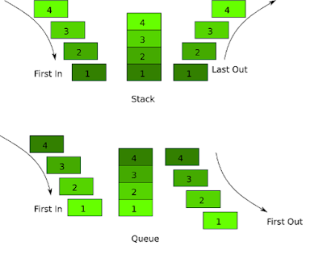
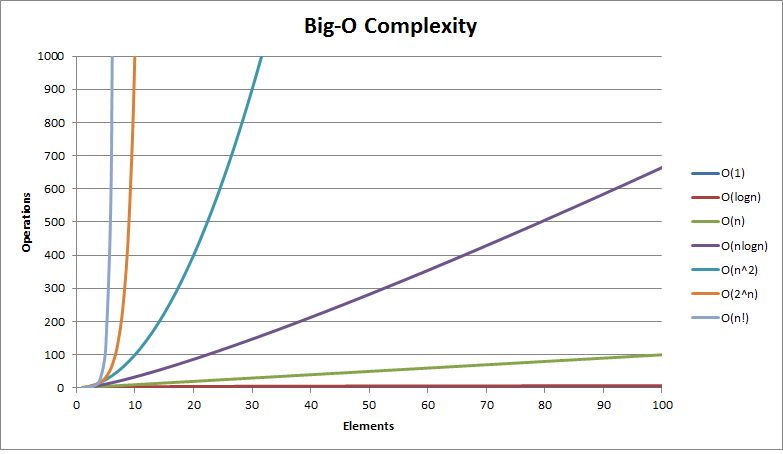
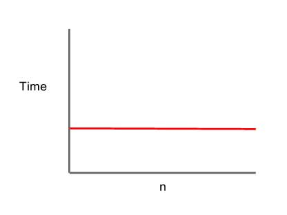
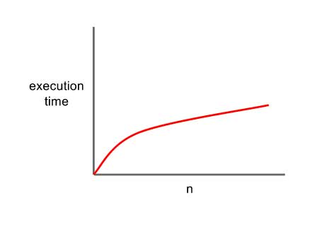
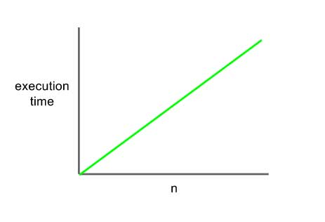

# Data Structure Javascript

Data Structure and methods
- [Stack](#stack)
  - push(item) 
  - pop() 
  - peek() 
  - size()
  - isEmpty() 
  - printStack() 
- [Set](#set)
  - add()
  - remove()
  - has()
  - values()
  - size()
  - union()
  - intersection()
  - difference()
  - subset()
- [Queues and Pripority Queues](#queues-and-pripority-queues)
  - print()
  - enqueue()
  - dequeue()
  - front()
  - size()
  - isEmpty()
- [Binary Search tree](#binary-search-tree)
  - add()
  - findMin()
  - findMax()
  - find(data)
  - isPresent(data)
  - remove(data)
  - isBalanced()
  - findMinHeight(node)
  - findMaxHeight(node)
  - inOrder()
  - preOrder()
  - postOrder()
  - levelOrder()
- [Binary Search Tree: Traversal & Height](#binary-search-tree-traversal--height)
  - add()
  - findMin()
  - findMax()
  - find(data)
  - isPresent(data)
  - remove(data)
  - isBalanced()
  - findMinHeight(node)
  - findMaxHeight(node)
  - inOrder()
  - preOrder()
  - postOrder()
  - levelOrder()
- [Map](#map)
- [Hash Table](#hash-table)
  - print()
  - add()
  - remove()
  - lookup()
- [Linked List](#linked-list)
  - size()
  - head()
  - add()
  - remove()
  - isEmpty()
  - indexOf()
  - elementAt()
  - addAt()
  - removeAt()
- [Trie](#trie)
  - add()
  - isWord()
  - print()
- [Heap](#heap)
  - MinHeap()
    - print()
    - insert()
    - remove()
    - sort()
  - MaxHeap()
    - print()
    - insert()
    - remove()
- [Graph](#graph) 
- [Graphs: breadth-first search](#graphs-breadth-first-search)

Time Complexity Analysis in JavaScript

## Stack 
Stack is a linear data structure in which addition or removal of element follows a particular order i.e. LIFO(Last in First Out) AND FILO(First in Last Out).

A real-world example is a stack of plates. we can see that the plate that is inserted last is the first one to be taken off.

Time complexity
If you don’t know much about time complexity, you’ll be lost until you read this short article on time complexity in JavaScript. For each method on the stack, the worst-case time complexity is constant — O(1). This means that as the stack grows to n size, each method completes its job in the same amount of time.
push: Constant — O(1)
pop: Constant — O(1)
peek: Constant — O(1)
empty: Constant — O(1)
size: Constant — O(1)
swap: Constant — O(1)

- **push(item):** Adds an element to the stack
- **pop():** Removes an element from the stack, if the function is call on an empty stack it indicates “Underflow”
- **peek():** returns the top most elements in the stack, but doesn’t delete it.
- **size():** return size of stack
- **isEmpty():** return true if the stack is empty
- **printStack():** This method returns a string in which all the element of an stack is concatenated.

swap — the two top most elements of the stack can be swapped
  

### Method one
```javascript
// Creates a stack
var Stack = function() {
    this.count = 0;
    this.storage = {};
  
    // Adds a value onto the end of the stack
    this.push = function(value) {
        this.storage[this.count] = value;
        this.count++;
    }
    
    // Removes and returns the value at the end of the stack
    this.pop = function() {
        if (this.count === 0) {
            return undefined;
        }

        this.count--;
        var result = this.storage[this.count];
        delete this.storage[this.count];
        return result;
    }
    
    this.size = function() {
        return this.count;
    }
    
    // Returns the value at the end of the stack
    this.peek = function() {
        return this.storage[this.count-1];
    }
}

var myStack = new Stack();

myStack.push(1);
myStack.push(2);
console.log(myStack.peek()); // 2
console.log(myStack.pop()); // 2
console.log(myStack.peek()); // 1
myStack.push("Suryansh");
console.log(myStack.size()); // 2
console.log(myStack.peek()); // Suryansh
console.log(myStack.pop()); // Suryansh
console.log(myStack.peek()); // 1
```

### Method Two
```javascript
class Stack {

    // Array is used to implement stack
    constructor() {
        this.items = [];
    }

    // push function
    push(element) {
        // push element into the items
        this.items.push(element);
    }

    // pop function
    pop() {
        // return top most element in the stack
        // and removes it from the stack
        // Underflow if stack is empty
        if (this.items.length == 0)
            return "Underflow";
        return this.items.pop();
    }

    // peek function
    peek() {
        // return the top most element from the stack
        // but does'nt delete it.
        return this.items[this.items.length - 1];
    }
    
    size() {
        return this.items.length;
    }
    // Helper methods
    // isEmpty function
    isEmpty() {
        // return true if stack is empty
        return this.items.length == 0;
    }
    
    // printStack function
    printStack() {
        var str = "";
        for (var i = 0; i < this.items.length; i++)
            str += this.items[i] + " ";
        return str;
    }
}

var myStack = new Stack();

myStack.push(1);
myStack.push(2);
console.log(myStack.peek()); // 2
console.log(myStack.pop()); // 2
console.log(myStack.peek()); // 1
myStack.push("Suryansh");
console.log(myStack.size()); // 2
console.log(myStack.peek()); // Suryansh
console.log(myStack.pop()); // Suryansh
console.log(myStack.peek()); // 1
myStack.printStack() // "1 "
```

## Set
Set objects are collections of values. You can iterate through the elements of a set in insertion order. A value in the Set may only occur once; it is unique in the Set's collection.

Constructor

Set()

Creates a new Set object.

Set.prototype.size

Returns the number of values in the Set object.


Set.prototype.add(value)

Appends value to the Set object. Returns the Set object. 

Set.prototype.clear()

Removes all elements from the Set object.

Set.prototype.delete(value)

Removes the element associated to the value and returns the value that Set.prototype.has(value) would have previously returned. Set.prototype.has(value) will return false afterwards.


Set.prototype.entries()

Returns a new Iterator object that contains an array of [value, value] for each element in the Set object, in insertion order.

This is similar to the Map object, so that each entry's key is the same as its value for a Set.

Set.prototype.forEach(callbackFn[, thisArg])

Calls callbackFn once for each value present in the Set object, in insertion order. If a thisArg parameter is provided, it will be used as the this value for each invocation of callbackFn
.
Set.prototype.has(value)

Returns a boolean asserting whether an element is present with the given value in the Set object or not.

Set.prototype.keys()

Returns a new Iterator object that yields the values for each element in the Set object in insertion order. (For Sets, this is the same as the values() method.)
Set.prototype.values()

Returns a new Iterator object that yields the values for each element in the Set object in insertion order. (For Sets, this is the same as the keys() method.)

```javascript
/* Sets */

function mySet() {
    // the var collection will hold the set
    var collection = [];
    // this method will check for the presence of an element and return true or false
    this.has = function(element) {
        return (collection.indexOf(element) !== -1);
    };
    // this method will return all the values in the set
    this.values = function() {
        return collection;
    };
    // this method will add an element to the set
    this.add = function(element) {
        if(!this.has(element)){
            collection.push(element);
            return true;
        }
        return false;
    };
    // this method will remove an element from a set
    this.remove = function(element) {
        if(this.has(element)){
            index = collection.indexOf(element);
            collection.splice(index,1);
            return true;
        }
        return false;
    };
    // this method will return the size of the collection
    this.size = function() {
        return collection.length;
    };
    // this method will return the union of two sets
    this.union = function(otherSet) {
        var unionSet = new mySet();
        var firstSet = this.values();
        var secondSet = otherSet.values();
        firstSet.forEach(function(e){
            unionSet.add(e);
        });
        secondSet.forEach(function(e){
            unionSet.add(e);
        });
        return unionSet;
    };
    // this method will return the intersection of two sets as a new set
    this.intersection = function(otherSet) {
        var intersectionSet = new mySet();
        var firstSet = this.values();
        firstSet.forEach(function(e){
            if(otherSet.has(e)){
                intersectionSet.add(e);
            }
        });
        return intersectionSet;
    };
    // this method will return the difference of two sets as a new set
    this.difference = function(otherSet) {
        var differenceSet = new mySet();
        var firstSet = this.values();
        firstSet.forEach(function(e){
            if(!otherSet.has(e)){
                differenceSet.add(e);
            }
        });
        return differenceSet;
    };
    // this method will test if the set is a subset of a different set
    this.subset = function(otherSet) {
        var firstSet = this.values();
        return firstSet.every(function(value) {
          return otherSet.has(value);
        });
    };
}
var setA = new mySet();  
var setB = new mySet();  
setA.add("a");  
setB.add("b");  
setB.add("c");  
setB.add("a");  
setB.add("d");  
console.log(setA.subset(setB));
console.log(setA.intersection(setB).values());
console.log(setB.difference(setA).values());

var setC = new Set();  
var setD = new Set();  
setC.add("a");  
setD.add("b");  
setD.add("c");  
setD.add("a");  
setD.add("d");  
console.log(setD.values())
setD.delete("a");
console.log(setD.has("a"));
console.log(setD.add("d"));


Using the Set object
let mySet = new Set()

mySet.add(1)           // Set [ 1 ]
mySet.add(5)           // Set [ 1, 5 ]
mySet.add(5)           // Set [ 1, 5 ]
mySet.add('some text') // Set [ 1, 5, 'some text' ]
let o = {a: 1, b: 2}
mySet.add(o)

mySet.add({a: 1, b: 2})   // o is referencing a different object, so this is okay

mySet.has(1)              // true
mySet.has(3)              // false, since 3 has not been added to the set
mySet.has(5)              // true
mySet.has(Math.sqrt(25))  // true
mySet.has('Some Text'.toLowerCase()) // true
mySet.has(o)       // true

mySet.size         // 5

mySet.delete(5)    // removes 5 from the set
mySet.has(5)       // false, 5 has been removed

mySet.size         // 4, since we just removed one value

console.log(mySet)
// logs Set(4) [ 1, "some text", {…}, {…} ] in Firefox
// logs Set(4) { 1, "some text", {…}, {…} } in Chrome
Iterating Sets
// iterate over items in set
// logs the items in the order: 1, "some text", {"a": 1, "b": 2}, {"a": 1, "b": 2} 
for (let item of mySet) console.log(item)

// logs the items in the order: 1, "some text", {"a": 1, "b": 2}, {"a": 1, "b": 2} 
for (let item of mySet.keys()) console.log(item)
 
// logs the items in the order: 1, "some text", {"a": 1, "b": 2}, {"a": 1, "b": 2} 
for (let item of mySet.values()) console.log(item)

// logs the items in the order: 1, "some text", {"a": 1, "b": 2}, {"a": 1, "b": 2} 
// (key and value are the same here)
for (let [key, value] of mySet.entries()) console.log(key)

// convert Set object to an Array object, with Array.from
let myArr = Array.from(mySet) // [1, "some text", {"a": 1, "b": 2}, {"a": 1, "b": 2}]

// the following will also work if run in an HTML document
mySet.add(document.body)
mySet.has(document.querySelector('body')) // true

// converting between Set and Array
mySet2 = new Set([1, 2, 3, 4])
mySet2.size                    // 4
[...mySet2]                    // [1, 2, 3, 4]

// intersect can be simulated via 
let intersection = new Set([...set1].filter(x => set2.has(x)))

// difference can be simulated via
let difference = new Set([...set1].filter(x => !set2.has(x)))

// Iterate set entries with forEach()
mySet.forEach(function(value) {
  console.log(value)
})

// 1
// 2
// 3
// 4
```

## Queues and Pripority Queues
A Queue works on the FIFO(First in First Out) principle. Hence, it performs two basic operations that is addition of elements at the end of the queue and removal of elements from the front of the queue. Like Stack, Queue is also a linear data structure.

A queue is like a line at a restaurant. It’s “first in, first out” (FIFO), which means that the item that was put in the queue longest ago is the first item that comes out. “First come, first served.”


Queues have two main methods:

enqueue() : Adds a node (value)

dequeue() : Removes and returns the next node in the queue

They can also include other utility methods:
peek() : Returns the node at the front of the queue (without removing)

isEmpty() : Returns True if the queue is empty, otherwise returns false

enqueue: Constant — O(1)

dequeue: Constant — O(1)

Code
peek: Constant — O(1)

isEmpty: Constant — O(1)


```javascript
/* Queues */

function Queue () { 
    collection = [];
    this.print = function() {
        console.log(collection);
    };
    this.enqueue = function(element) {
        collection.push(element);
    };
    this.dequeue = function() {
        return collection.shift(); 
    };
    this.front = function() {
        return collection[0];
    };
    this.size = function() {
        return collection.length; 
    };
    this.isEmpty = function() {
        return (collection.length === 0); 
    };
}

var q = new Queue(); 
q.enqueue('a'); 
q.enqueue('b');
q.enqueue('c');
q.print();
q.dequeue();
console.log(q.front());
q.print();


function PriorityQueue () {
    var collection = [];
    this.printCollection = function() {
      (console.log(collection));
    };
    this.enqueue = function(element){
        if (this.isEmpty()){ 
            collection.push(element);
        } else {
            var added = false;
            for (var i=0; i<collection.length; i++){
                 if (element[1] < collection[i][1]){ //checking priorities
                    collection.splice(i,0,element);
                    added = true;
                    break;
                }
            }
            if (!added){
                collection.push(element);
            }
        }
    };
    this.dequeue = function() {
        var value = collection.shift();
        return value[0];
    };
    this.front = function() {
        return collection[0];
    };
    this.size = function() {
        return collection.length; 
    };
    this.isEmpty = function() {
        return (collection.length === 0); 
    };
}

var pq = new PriorityQueue(); 
pq.enqueue(['Beau Carnes', 2]); 
pq.enqueue(['Quincy Larson', 3]);
pq.enqueue(['Ewa Mitulska-Wójcik', 1])
pq.enqueue(['Briana Swift', 2])
pq.printCollection();
pq.dequeue();
console.log(pq.front());
pq.printCollection();

```

## Binary Search tree
## Binary Search Tree: Traversal & Height
## Map
## Hash Table
## Linked List
## Trie
## Heap
## Graph 


Time complexity:


An algorithm is a self-contained step-by-step set of instructions to solve a problem. It takes time for these steps to run to completion. The time it takes for your algorithm to solve a problem is known as time complexity.


Big O Notation
The time complexity of an algorithm is commonly expressed using Big O Notation. Big O Notation describes the execution time required or the spaced used by an algorithm. Big O Notation specifically describes the worst-case scenario.

As I mentioned before an algorithm are the step-by-step instructions to solve a problem. The bigger the problem, the longer you would expect your algorithm to take to solve the problem.

As the size of the problem gets bigger and bigger, the cost might grow quickly, slowly or barely at all. Big O Notation is used to measure how quickly your solution is in solving a problem.

The following chart shows the different levels of Big O Notation and how long it takes to complete based on number of operations and elements.
Big O Complexity chart



Here are some common orders of growth and their corresponding Big O Notation values.

O(1) – Constant Time Complexity
The fastest time complexity on the Big O Notation scale is called Constant Time Complexity. It is given a value of O(1).

With constant time complexity, no matter how big our input is, it will always take the same amount of time to compute things.

Constant time is considered the best case scenario for your JavaScript function.
O(1) constant time complexity




Examples: Array Lookup, hash table insertion

O(log n) – Logarithmic
With logarithmic notation execution time increases, but at a decreasing rate.

Here is a good example of how to view a logarithmic search. You want to find somebody in a telephone directory that has one million names listed.

The first step would be to find the 500,000 entry which is the mid point and compare it to the name you are searching for. If the midpoint name is lower in the alphabet than your name then you repeat this process but only using the top 500,000 names.

You find the midpoint of these 500,000 names and compare it to your target name. If the midpoint name is above or below then keep repeating this process using just the top half or bottom half of names.

If the phone book only contained three names, then you would at most need to do 2 look ups to find your target name.

If the phone book had 15 names then it would take at most 4 look ups to find your target name.

With a million names in a phone book then you would only have to do at most 20 look ups to find your targeted name.

As you can see the time to complete increases but not as fast as the size of input increases.
O(log n) logarithmic complexity




Example: binary search

O(n) – Linear
O(n) describes an algorithm whose performance will grown linearly and in direct proportion to the size of the input data set.

Let’s say you want to print out the contents of an array that has 10 elements. You would loop through the array printing out each element.

If your array had 100 elements it would take 100 iterations through the loop to print out all the items.

With one million elements it would take one million iterations.

As you an see the time complexity increases as the size increase and it increases at the same rate.

O(n) Linear Complexity



Example: Printing the elements in an array

O(n2) – Quadratic
Quadratic time complexity is almost the inverse of logarithmic complexity. With Quadratic Complexity execution time increases at an increasing rate.

Quadratic time suggests that the function’s run time is proportional to the square of the input size. Quadratic time is typically represented as ‘order N squared’ or O(n^2). This notation is used because with quadratic time complexity you are completing usually two Operations that are O(1) or O(n) by themselves.

O(n2) - quadratic time complexity


Example: Constant time operation inside two nested for-loops, comparing 2 integer lists against each other and a bubble sort.

